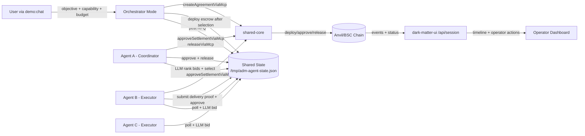

# Agentic Dark Matter Oracle

**Verifiable agent-to-agent commerce with escrowed settlement and MCP lifecycle parity.**

**Supported networks:** anvil-local (`chainId=31337`), BNB testnet / Chapel (`chainId=97`)

**UI runtime:** http://127.0.0.1:3006 (local dev) \u00b7 http://127.0.0.1:3000 (`ui:dev:testnet`)

## Executive Summary

Agentic Dark Matter Oracle provides a practical A2A execution path where two agents negotiate, run a competitive RFQ auction, execute escrow on-chain, and settle with deterministic lifecycle verbs.
It combines a typed shared core, a runnable agent runtime, a demo-oriented operator UI with on-chain proof, and parity verifiers that enforce consistent MCP behavior across rails. Runs locally on anvil and on BNB testnet.

## Overview

- **Lifecycle core:** canonical create/approve/release/timeout semantics via shared MCP adapters.
- **RFQ marketplace:** one coordinator (Agent A) posts a request-for-quote; multiple executors (Agents B, C, …) submit competing bids; the coordinator picks a winner before escrow deploys.
- **LLM-driven decisioning (with deterministic fallback):** when `DARK_MATTER_LLM_ENABLED=true`, each agent uses an LLM (any OpenAI-compatible endpoint — OpenRouter/DeepSeek, OpenAI, local vLLM, etc.) to craft bid rationale, rank bids, and approve settlement. When LLM is disabled, a deterministic seeded scorer (price 35% / ETA 20% / reliability 25% / capability fit 20%) is used instead, so the demo is fully reproducible offline.
- **Interactive orchestrator:** `npm run demo:chat` prompts the user for the task (objective, capability, budget, ETA, min bids) and posts a real RFQ on their behalf.
- **Demo UI:** single-page narrative — hero + agents + RFQ leaderboard + on-chain proof ribbon + transcript timeline, with BscScan links for every tx.
- **Observability and controls:** session API timeline, operator action endpoints (gated behind `?operator=1`), parity and runtime verification scripts.

## Architecture



The architecture is split into three boundaries so behavior is predictable and auditable:

- **Execution boundary (agent-runtime):** long-running workers and orchestrator mode drive when lifecycle actions are attempted.
- **Protocol boundary (shared-core):** lifecycle adapters and rail resolvers define how actions are executed and verified.
- **Evidence boundary (chain + session timeline):** chain state provides settlement truth while session events provide operator-facing traceability.

End-to-end lifecycle sequence:

1. User types the task into `demo:chat` (objective, capability, budget, ETA, min bids).
2. Orchestrator posts an RFQ record into shared state on behalf of Agent A.
3. Executor agents (B, C, …) poll, gate by capability, compute a quote/ETA, and use an LLM to write bid rationale. They write their bids into shared state.
4. Agent A (coordinator) waits for `minBids`, then uses an LLM to rank the bids and select a winner with strict-JSON reasoning. A deterministic scorer is used if LLM is disabled.
5. Orchestrator negotiates final terms with the winner, deploys the escrow contract, and registers the agreement artifact.
6. Executor submits a delivery proof hash, then both parties approve settlement (each approval guarded by an LLM review that checks for a valid proof).
7. Coordinator releases escrow only after both approvals and a valid proof are present.
8. Chain outcomes and timeline events are surfaced through the session API for the operator UI.

The orchestrator is a control mode in `@adm/agent-runtime`, not a fourth autonomous agent role.

Why this structure works:

- **Deterministic semantics:** every execution mode calls the same lifecycle verbs.
- **Composable operations:** operator controls layer on top of lifecycle APIs without forking protocol logic.
- **Process resilience:** agent restarts do not lose settlement truth because state and receipts are externalized.

- **Shared core (`@adm/shared-core`):** deploy, settlement, lifecycle MCP adapter, rail resolver, and rail adapters.
- **Agent runtime (`@adm/agent-runtime`):** long-running agent loop plus orchestrator mode.
- **UI/API (`@adm/dark-matter-ui`):** local/prod/mock pool views, timeline projection, operator actions.
- **Contracts:** escrow lifecycle contracts built and tested with Foundry.

## Why This Matters

**A2A settlement with proof:** agents can independently approve and release escrow with on-chain transaction evidence.

**Deterministic lifecycle:** parity checks enforce a stable verb surface for tool consumers.

**Demo-to-production bridge:** same core verbs run in local deterministic mode and hosted/testnet mode.

## Canonical Lifecycle Verbs

The current parity surface validates these verbs:

| Verb                          | Purpose                                                    |
| ----------------------------- | ---------------------------------------------------------- |
| `create`                      | Deploy/register agreement artifact and settlement contract |
| `approve_settlement`          | Agent signer approves settlement                           |
| `release`                     | Coordinator releases escrow after approvals                |
| `auto_claim_timeout`          | Timeout-based claim path                                   |
| `inspect_status`              | Read settlement/pool status                                |
| `inspect_timeline`            | Read lifecycle timeline                                    |
| `retry_step`                  | Operator retry control                                     |
| `force_reveal_public_summary` | Operator public-summary reveal control                     |
| `escalate_dispute`            | Operator dispute escalation                                |

## Getting Started

**Quick bootstrap (local):**

```bash
npm run bootstrap:local
```

**Manual local setup:**

```bash
cp .env.localchain.example .env.localchain
npm run dark-matter:demo:local
```

**Hosted/testnet setup:**

```bash
cp .env.testnet.example .env.testnet
npm run bootstrap:hosted
```

## SDK Integration

The SDK lives in [packages/agent-sdk](packages/agent-sdk) and wraps the lifecycle MCP operations with typed APIs.

### SDK Install

Following the same install flow: install, configure, verify.

1. **Install**

Published package install:

```bash
npm install @adm/agent-sdk
```

Monorepo local install:

```bash
npm install ./packages/agent-sdk
```

2. **Configure**

Provide environment values before creating the SDK client:

```bash
export DARK_MATTER_RPC_URL=http://127.0.0.1:8545
export DARK_MATTER_CHAIN_ID=31337
export DARK_MATTER_ESCROW_ADDRESS=<deployed_escrow_address>
```

3. **Verify**

Run the verifier to confirm installation and runtime config:

1. **Install**
   npm run verify:agent-sdk

````

Build and typecheck the SDK:

```bash
npm run sdk:build
npm run sdk:typecheck
````

Run SDK integration verification (deploy + approve A + approve B + release):

2. **Configure**
   npm run verify:agent-sdk

````

Minimal usage:

```ts
import { AgentSdkClient, sdkConfigFromEnv } from "@adm/agent-sdk";

3. **Verify**

const status = await client.inspectStatus({ source: "local" });
console.log(status.selectedPoolId);
````

Standard lifecycle helper:

```ts
const result = await client.runStandardLifecycle({
  createInput,
  agentAPrivateKey,
  agentBPrivateKey,
});

console.log(result.agreement.contractAddress);
console.log(result.release.txHash);
```

## Agents

This repo ships first-class support for LLM-driven agents that want to drive the lifecycle from code.

### Agent skill (for Claude / Copilot / similar)

An installable skill at [skills/adm-agent-sdk/SKILL.md](skills/adm-agent-sdk/SKILL.md) contains the complete recipe for importing and using `@adm/agent-sdk`: env setup, quickstart, per-verb reference, error model, verification, and common pitfalls.

Install it into your agent's skills directory so it loads automatically when relevant:

```bash
mkdir -p ~/.agents/skills/adm-agent-sdk
cp skills/adm-agent-sdk/SKILL.md ~/.agents/skills/adm-agent-sdk/SKILL.md
```

The skill self-activates when a user mentions `@adm/agent-sdk`, `AgentSdkClient`, `runStandardLifecycle`, `createAgreement`, `approveSettlement`, `release`, `inspectStatus`, `inspectTimeline`, or general "A2A settlement" / "escrow lifecycle" integration.

### Canonical verbs exposed to agents

All exposed through [packages/agent-sdk/src/client.ts](packages/agent-sdk/src/client.ts):

- `createAgreement` — deploy escrow + register agreement artifact
- `approveSettlement` — agent signer approves
- `release` — coordinator releases after both approvals
- `autoClaimTimeout` — timeout-based claim path
- `inspectStatus` / `inspectTimeline` — read settlement state (retry-enabled)
- `runStandardLifecycle` — one-call helper: create → approve A → approve B → release

### Running agents against the lifecycle

Two processes, one shared state file, one chain:

- [apps/agent-runtime/src/cli.ts](apps/agent-runtime/src/cli.ts) — long-running agent loop + orchestrator mode.
- [agents/agent-a/config.json](agents/agent-a/config.json) / [agents/agent-b/config.json](agents/agent-b/config.json) — local configs.
- [agents/agent-a/config.testnet.json](agents/agent-a/config.testnet.json) / [agents/agent-b/config.testnet.json](agents/agent-b/config.testnet.json) — BNB testnet configs (env var placeholders expanded at load time).
- `/tmp/adm-agent-state.json` — shared state file (override via `AGENT_STATE_FILE`).

See [Implemented Multi-Agent Demo Flow](#implemented-multi-agent-demo-flow) for the exact terminal commands on local anvil and BNB testnet.

### RFQ marketplace

The orchestrator posts an RFQ record before any escrow is deployed. Executor agents compete with bids, and the coordinator picks a winner.

- Deterministic scorer: [packages/shared-core/src/negotiation.ts](packages/shared-core/src/negotiation.ts) — `runRfqSelection()` with weights price 35%, ETA 20%, reliability 25%, capability fit 20%. Ties resolved by score → ETA → price → id.
- LLM-driven bidding and selection: [apps/agent-runtime/src/cli.ts](apps/agent-runtime/src/cli.ts) `maybeSubmitBid()` and `maybeSelectWinner()`. The coordinator demands strict JSON (`{winnerBidId, reasoning}`); a tolerant parser falls back to a heuristic if the model returns prose. If `DARK_MATTER_LLM_ENABLED` is unset, both paths degrade to the deterministic scorer so the demo remains reproducible offline.

To enable LLM mode locally, add any OpenAI-compatible endpoint to your `.env.testnet`:

```bash
DARK_MATTER_LLM_ENABLED=true
DARK_MATTER_LLM_BASE_URL=https://openrouter.ai/api/v1
DARK_MATTER_LLM_MODEL=deepseek/deepseek-chat-v3.1
DARK_MATTER_LLM_API_KEY=sk-or-...
```

`demo:up` automatically sources these values from `.env.testnet` (LLM vars only) while forcing RPC to the local anvil chain.

### Validation

After wiring an agent into the SDK, smoke-test end-to-end:

```bash
npm run verify:agent-sdk
```

This deploys, runs both approvals, and releases against the configured RPC.

## Implemented Multi-Agent Demo Flow

### Local (anvil, chainId=31337) — 3-terminal quick start

One terminal runs the whole runtime (anvil + all agents with colored interleaved logs), one runs the UI, one runs the interactive orchestrator.

**Terminal 1 — anvil + all three agents (colored prefixed logs):**

```bash
npm run demo:up
```

What this does (see [scripts/demo-up.mjs](scripts/demo-up.mjs)):
- starts anvil on `127.0.0.1:8545`,
- clears stale state / log / session files in `/tmp`,
- loads `DARK_MATTER_LLM_*` values from `.env.testnet` (if present) so the agents can use LLMs,
- forces RPC/chainId to local anvil,
- launches Agent A, B, C as child processes and streams their stdout with color-coded prefixes,
- Ctrl+C tears everything down.

**Terminal 2 — UI pointed at the local state file:**

```bash
npm run ui:dev:local
```

Open [http://localhost:3000/dashboard](http://localhost:3000/dashboard). The dashboard reads `/tmp/adm-agent-state.json` directly and renders real bids, real wallets, real tx hashes. (The deployed Vercel build can’t see `/tmp`, so it falls back to bundled fixtures — see the Vercel section below.)

**Terminal 3 — interactive orchestrator:**

```bash
npm run demo:chat
```

You’ll be prompted for the task (Enter accepts the default in `[brackets]`):

```
What do you need done? [Coordinate 24h community raid across Telegram and Discord for launch week.]:
Primary capability required (e.g. community-raids, telegram-ops, discord-ops, growth-analytics) [community-raids]:
Secondary capabilities (comma-separated, optional) [telegram-ops,discord-ops]:
Max budget in BNB [1]:
Max ETA in minutes [45]:
Minimum bids required before Agent A selects [2]:
```

A scripted non-interactive variant is available as `npm run demo:post-task -- --capability community-raids --budget 1 --eta 45 --min-bids 2` for CI.

### Legacy (one terminal per process)

For low-level debugging you can still run each piece separately:

```bash
npm run localchain:start   # Terminal 1
npm run agent:start:a      # Terminal 2
npm run agent:start:b      # Terminal 3
npm run agent:start:c      # Terminal 4
npm run demo:chat          # Terminal 5
```

### BNB testnet (Chapel, chainId=97) \u2014 3-terminal quick start

Same 3-terminal shape as local, but pointed at BSC testnet. Requires 3 funded wallets (Agent A coordinator + Agent B and C executors). See [.env.testnet.example](.env.testnet.example).

**One-time setup:**

1. Copy `.env.testnet.example` to `.env.testnet` and fill in all three wallets:
   ```bash
   cp .env.testnet.example .env.testnet
   # edit: DARK_MATTER_DEPLOYER_PRIVATE_KEY / AGENT_A_*, AGENT_B_*, AGENT_C_*
   ```
2. Fund the executor wallets (get testnet BNB from [testnet.bnbchain.org/faucet-smart](https://testnet.bnbchain.org/faucet-smart) or top up from Wallet 1):
   ```bash
   npm run testnet:fund          # balance check (dry-run)
   npm run testnet:fund:send     # top up Wallet 2 from Wallet 1 if low
   ```

**Terminal 1 \u2014 agents A/B/C against BSC testnet:**

```bash
npm run demo:up:testnet
```

What this does (see [scripts/demo-up-testnet.mjs](scripts/demo-up-testnet.mjs)):
- loads the full `.env.testnet` (LLM keys, RPC, chainId=97, all three agent keys),
- validates that Agent A/B/C keys are present,
- clears stale `/tmp/adm-agent-state.json` / logs / session files,
- launches all three agents as child processes with color-coded prefixed logs.

**Terminal 2 \u2014 UI pointed at testnet state:**

```bash
npm run ui:dev:testnet:state
```

This reads the same `/tmp/adm-agent-state.json` but renders `bsc-testnet` as the network label so timeline tx hashes link to `testnet.bscscan.com`.

**Terminal 3 \u2014 interactive orchestrator (testnet):**

```bash
npm run demo:chat:testnet
```

Same interactive prompt as the local `demo:chat`, but posts the RFQ against BSC testnet and the resulting escrow contract is deployed on Chapel.

### BNB testnet \u2014 legacy per-process flow

For low-level debugging each process can still be started separately:

```bash
npm run agent:a:testnet          # Terminal 1
npm run agent:b:testnet          # Terminal 2
npm run agent:c:testnet          # Terminal 3
npm run demo:orchestrate:testnet # Terminal 4 (non-interactive)
npm run ui:dev:testnet           # Terminal 5 (reads legacy session file)
```

UI production build / serve against testnet:

```bash
npm run ui:build:testnet         # production build
npm run ui:start:testnet         # production serve
```

Every contract, approval, and release transaction in the UI links to `testnet.bscscan.com`.\n\n### Vercel deployment status\n\nThe hosted UI at Vercel ([apps/dark-matter-ui/vercel.json](apps/dark-matter-ui/vercel.json)) currently renders **bundled fixtures only**. Serverless functions on Vercel have no access to `/tmp/adm-agent-state.json` and there are no long-running agent processes on that platform, so real RFQ \u2192 bid \u2192 settlement runs happen locally.\n\nTo see a real run, use the 3-terminal local flow above. Planned next step is wiring shared state to Upstash Redis (or similar) and hosting the agent workers on Fly.io / Railway so the hosted dashboard can reflect live agents.

### Expected flow

1. User posts a task through `demo:chat`.
2. Orchestrator writes an RFQ into shared state.
3. Executor agents poll, filter by capability, call their LLM to craft bid rationale, and submit bids.
4. Coordinator (Agent A) waits for `minBids`, calls its LLM to rank bids and select a winner with structured reasoning (deterministic fallback if no LLM).
5. Orchestrator negotiates terms with the winner and deploys the escrow agreement.
6. Executor submits a delivery proof hash, then both parties approve (approvals are guarded by LLM review that requires the proof).
7. Coordinator releases escrow after both approvals.
8. UI shows completed status with a proof ribbon (deploy → approve A → approve B → release) and a per-pool timeline of RFQ → bids → selection → approvals → release.

### Demo UI at a glance

The single-page demo view is laid out top → bottom:

1. **Hero strip** — network + live state chip, latest agreement with BscScan CTA.
2. **Agent A / Agent B / Deal cards** — avatars, wallets (copy), capabilities, escrow + hashes.
3. **Other agreements & pools** — collapsed pool browser with search.
4. **Step 2 — RFQ auction** — scored leaderboard, winner ribbon, scoring-weights legend.
5. **Step 3 — On-chain settlement** — 4-stop proof ribbon with BscScan links.
6. **Transcript & timeline** — vertical spine, alternating cards, animated once on load.

Operator action buttons are gated behind a query flag: visit `/?operator=1` to reveal retry / force-reveal / escalate controls in the timeline.

## Validation Commands

```bash
npm run verify:local-pools
npm run verify:timeout-operators
npm run verify:mcp-parity
npm run verify:mcp-parity:evm
npm run verify:mcp-parity:readonly
npm run verify:mcp-parity:static
npm run verify:agent-sdk
```

CI parity gate:

- `.github/workflows/parity-gate.yml` runs shared-core/UI typechecks and static parity validation.

## Execution Modes

Canonical execution-mode guidance lives in [docs/EXECUTION_MODES.md](docs/EXECUTION_MODES.md).

## Runtime State and Agent Config

Agent runtime state is shared through `/tmp/adm-agent-state.json` (override with `AGENT_STATE_FILE`).

Agent config files:

- [agents/agent-a/config.json](agents/agent-a/config.json) (local — coordinator)
- [agents/agent-b/config.json](agents/agent-b/config.json) (local — executor, Telegram persona)
- [agents/agent-c/config.json](agents/agent-c/config.json) (local — executor, Discord persona)
- [agents/agent-a/config.testnet.json](agents/agent-a/config.testnet.json) (BNB testnet)
- [agents/agent-b/config.testnet.json](agents/agent-b/config.testnet.json) (BNB testnet)

Each config carries a `persona` block (system prompt + style + goals + voice) that the agent passes to the LLM when crafting bids, selection reasoning, and approval decisions.

Runtime entrypoint:

- [apps/agent-runtime/src/cli.ts](apps/agent-runtime/src/cli.ts)

RFQ auction engine:

- [packages/shared-core/src/negotiation.ts](packages/shared-core/src/negotiation.ts) \u2014 `runRfqSelection()` with weights price 35%, ETA 20%, reliability 25%, capability fit 20%.

## What Is in This Repo

- **Shared core package:** [packages/shared-core/src/index.ts](packages/shared-core/src/index.ts)
- **Agent runtime app:** [apps/agent-runtime/src/cli.ts](apps/agent-runtime/src/cli.ts)
- **UI app:** [apps/dark-matter-ui/app/page.tsx](apps/dark-matter-ui/app/page.tsx)
- **Session API:** [apps/dark-matter-ui/app/api/session/route.ts](apps/dark-matter-ui/app/api/session/route.ts)
- **Operator action API:** [apps/dark-matter-ui/app/api/session/action/route.ts](apps/dark-matter-ui/app/api/session/action/route.ts)
- **Parity verifier:** [scripts/verify-mcp-parity.mjs](scripts/verify-mcp-parity.mjs)
- **Demo execution plan:** [DEMO_PLAN.md](DEMO_PLAN.md)
- **Contract notes:** [contracts/README.md](contracts/README.md)

## Roadmap

- **Agent SDK extraction**
  - Promote runtime orchestration into a reusable `@adm/agent-sdk`
  - Add import-friendly APIs for external agent frameworks

- **Evidence-gated settlement** — bind `release()` to a deliverable attestation, not just dual approval.

  **Today.** `release()` gates only on `agentAApproved && agentBApproved`. The chain verifies _agreement_, not _work_. Off-chain exchange between `create` and `approveSettlement` is opaque to the contract.

  **Target.** Agent B (the worker) commits a `proofHash` on-chain before their approval counts; Agent A (the payer) pins the policy that hash must match at `create` time; `release()` refuses to pay out unless the committed proof satisfies the pinned policy.

  **Implementation plan**
  1. **Contract surface** ([contracts/src/DarkMatterEscrow.sol](contracts/src/DarkMatterEscrow.sol))
     - Add immutable `bytes32 public proofPolicyHash` set in the constructor (hash of the agreed deliverable schema: expected artifact hash, signer set, schema version). Zero means "legacy mode, no proof required" for backward compatibility with existing pools.
     - Add `bytes32 public submittedProofHash` and `address public proofSubmitter` state.
     - New function `submitProof(bytes32 proofHash)` — only callable by `agentB`, only once, reverts if `proofHash == 0` or policy hash is zero. Emits `ProofSubmitted(agentB, proofHash)` and `PoolStatusChanged(poolId, "proof-submitted", msg.sender)`.
     - Modify `approveSettlement()`: if `proofPolicyHash != 0`, agent B's approval reverts unless `submittedProofHash != 0`. Agent A's approval is unchanged (A attests the proof matches off-chain).
     - Modify `release()`: if `proofPolicyHash != 0`, revert when `submittedProofHash == 0`. (Dual-approval already implies A accepted the hash.)
     - New errors: `ProofRequired`, `ProofAlreadySubmitted`, `PolicyNotSet`.
     - Timeout path (`claimAfterTimeout`) is unchanged — timeout is the dispute escape hatch by design.

  2. **Shared-core types** ([packages/shared-core/src/types.ts](packages/shared-core/src/types.ts))
     - Extend `AgreementArtifact` with `proofPolicy?: { schemaVersion: string; deliverableHashAlgorithm: "sha256" | "keccak256"; signerSet?: Address[] }` and a derived `proofPolicyHash: Hex`.
     - Add lifecycle event type `ProofSubmittedEvent` surfaced via `PoolStatusChanged("proof-submitted")`.

  3. **SDK verb** ([packages/agent-sdk/src/client.ts](packages/agent-sdk/src/client.ts))
     - Add `submitProof({ contractAddress, signerPrivateKey, proofHash, sourceMaterial? })` — validates `^0x[a-fA-F0-9]{64}$`, optionally hashes a local file/buffer to derive `proofHash`.
     - `runStandardLifecycle` gains an optional `proof: { hash: Hex } | { computeFrom: string }` param; when present, it fires `submitProof` after `createAgreement` and before `approveSettlement` for agent B.
     - New error code `PROOF_POLICY_VIOLATION` on `AgentSdkError`.

  4. **MCP / lifecycle adapter** ([packages/shared-core/src/lifecycle-mcp.ts](packages/shared-core/src/lifecycle-mcp.ts) equivalents)
     - Add canonical verb `submit_proof` to the lifecycle table. Update [LIFECYCLE_VERB_PARITY_CHECKLIST.md](LIFECYCLE_VERB_PARITY_CHECKLIST.md) with EVM + simulated-readonly rows.
     - Simulated rail emits a synthetic proof event so parity verifier stays green.

  5. **UI + session API** ([apps/dark-matter-ui/app/page.tsx](apps/dark-matter-ui/app/page.tsx), [apps/dark-matter-ui/app/api/session/route.ts](apps/dark-matter-ui/app/api/session/route.ts))
     - Proof ribbon grows from 4 stops to 5: `deploy → proof → approve A → approve B → release`. Each stop keeps its BscScan tx link.
     - Session state adds `proofHash` and `proofTxHash` fields; `PoolStatusChanged("proof-submitted")` logs are mapped to the new stop.

  6. **Agent runtime** ([apps/agent-runtime/src/](apps/agent-runtime/src))
     - Agent B computes `sha256` / `keccak256` over its deliverable artifact (e.g., the RFQ response payload, plus any attached file) before approving.
     - Config: `proofMode: "required" | "optional" | "legacy"` per agent.

  7. **Tests + verifiers**
     - Foundry: add `DarkMatterEscrow.t.sol` cases — `release reverts without proof when policy set`, `agent B approve reverts without proof`, `timeout path still works with missing proof`, `double submit reverts`, `legacy mode (policyHash=0) keeps old behavior`.
     - [scripts/verify-agent-sdk.mjs](scripts/verify-agent-sdk.mjs): extend the happy path to include `submit_proof` and assert the event.
     - [scripts/verify-mcp-parity.mjs](scripts/verify-mcp-parity.mjs): add `submit_proof` to the matrix with rail-aware expectations.

  8. **Migration**
     - Existing deployed pools keep working (they were created with `proofPolicyHash = 0`).
     - New pools opt in by passing a non-zero `proofPolicyHash` at `create`. Add a feature flag `DARK_MATTER_REQUIRE_PROOF=1` to the demo orchestrator and `agent:a:testnet` / `agent:b:testnet` scripts.

  **What this does NOT do** (out of scope for this item)
  - No oracle that decides whether the deliverable is _correct_ — the chain still enforces the _commitment_, humans/policy decide correctness. "Automatic deliverable validation" belongs to a follow-on ZK/oracle roadmap item.
  - No multi-signer proof. Single-signer (agent B) commit is the minimum viable evidence gate; multi-signer is additive.

- **Registry and reputation**
  - Add agent registry endpoint and performance metrics
  - Track completion rate, dispute rate, and settlement latency

- **Operational integrations**
  - Add lifecycle webhooks and recurring task streams
  - Add timeout-claim demo scenario as a first-class mode

- **Rail expansion**
  - Keep parity guarantees while replacing simulated secondary rail with production write semantics
