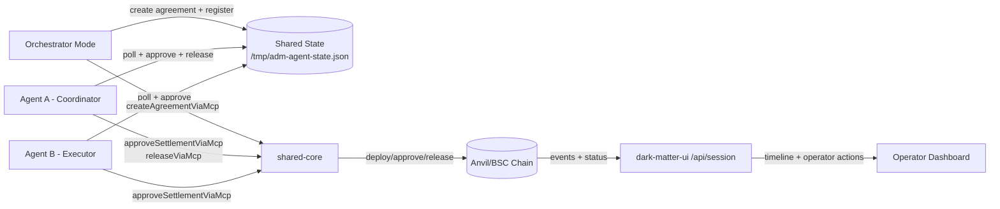

# Agentic Dark Matter Oracle

**Verifiable agent-to-agent commerce with escrowed settlement and MCP lifecycle parity.**

**Supported networks:** anvil-local (`chainId=31337`), BNB testnet / Chapel (`chainId=97`)

**UI runtime:** http://127.0.0.1:3006 (local dev) \u00b7 http://127.0.0.1:3000 (`ui:dev:testnet`)

## Executive Summary

Agentic Dark Matter Oracle provides a practical A2A execution path where two agents negotiate, run a competitive RFQ auction, execute escrow on-chain, and settle with deterministic lifecycle verbs.
It combines a typed shared core, a runnable agent runtime, a demo-oriented operator UI with on-chain proof, and parity verifiers that enforce consistent MCP behavior across rails. Runs locally on anvil and on BNB testnet.

## Overview

- **Lifecycle core:** canonical create/approve/release/timeout semantics via shared MCP adapters.
- **RFQ auction:** deterministic seeded scoring (price / ETA / reliability / capability fit) picks the counterparty before escrow deploys.
- **Agent runtime:** two separately-running agents (coordinator + executor) driven by config and shared state.
- **Demo UI:** single-page narrative — hero + agents + RFQ leaderboard + on-chain proof ribbon + transcript timeline, with BscScan links for every tx.
- **Observability and controls:** session API timeline, operator action endpoints (gated behind `?operator=1`), parity and runtime verification scripts.

## Architecture



The architecture is split into three boundaries so behavior is predictable and auditable:

- **Execution boundary (agent-runtime):** long-running workers and orchestrator mode drive when lifecycle actions are attempted.
- **Protocol boundary (shared-core):** lifecycle adapters and rail resolvers define how actions are executed and verified.
- **Evidence boundary (chain + session timeline):** chain state provides settlement truth while session events provide operator-facing traceability.

End-to-end lifecycle sequence:

1. Orchestrator creates agreement context and escrow state, then records shared runtime state.
2. Agent A and Agent B independently poll and approve through the same lifecycle methods.
3. Coordinator releases only after approvals satisfy settlement conditions.
4. Chain outcomes and timeline events are surfaced through the session API for operator actions.

The orchestrator is a control mode in `@adm/agent-runtime`, not a third autonomous agent role.

Why this structure works:

- **Deterministic semantics:** every execution mode calls the same lifecycle verbs.
- **Composable operations:** operator controls layer on top of lifecycle APIs without forking protocol logic.
- **Process resilience:** agent restarts do not lose settlement truth because state and receipts are externalized.

- **Shared core (`@adm/shared-core`):** deploy, settlement, lifecycle MCP adapter, rail resolver, and rail adapters.
- **Agent runtime (`@adm/agent-runtime`):** long-running agent loop plus orchestrator mode.
- **UI/API (`@adm/dark-matter-ui`):** local/prod/mock pool views, timeline projection, operator actions.
- **Contracts:** escrow lifecycle contracts built and tested with Foundry.

## Why This Matters

**A2A settlement with proof:** agents can independently approve and release escrow with on-chain transaction evidence.

**Deterministic lifecycle:** parity checks enforce a stable verb surface for tool consumers.

**Demo-to-production bridge:** same core verbs run in local deterministic mode and hosted/testnet mode.

## Canonical Lifecycle Verbs

The current parity surface validates these verbs:

| Verb                          | Purpose                                                    |
| ----------------------------- | ---------------------------------------------------------- |
| `create`                      | Deploy/register agreement artifact and settlement contract |
| `approve_settlement`          | Agent signer approves settlement                           |
| `release`                     | Coordinator releases escrow after approvals                |
| `auto_claim_timeout`          | Timeout-based claim path                                   |
| `inspect_status`              | Read settlement/pool status                                |
| `inspect_timeline`            | Read lifecycle timeline                                    |
| `retry_step`                  | Operator retry control                                     |
| `force_reveal_public_summary` | Operator public-summary reveal control                     |
| `escalate_dispute`            | Operator dispute escalation                                |

## Getting Started

**Quick bootstrap (local):**

```bash
npm run bootstrap:local
```

**Manual local setup:**

```bash
cp .env.localchain.example .env.localchain
npm run dark-matter:demo:local
```

**Hosted/testnet setup:**

```bash
cp .env.testnet.example .env.testnet
npm run bootstrap:hosted
```

## SDK Integration

The SDK lives in [packages/agent-sdk](packages/agent-sdk) and wraps the lifecycle MCP operations with typed APIs.

### SDK Install

Following the same install flow: install, configure, verify.

1. **Install**

Published package install:

```bash
npm install @adm/agent-sdk
```

Monorepo local install:

```bash
npm install ./packages/agent-sdk
```

2. **Configure**

Provide environment values before creating the SDK client:

```bash
export DARK_MATTER_RPC_URL=http://127.0.0.1:8545
export DARK_MATTER_CHAIN_ID=31337
export DARK_MATTER_ESCROW_ADDRESS=<deployed_escrow_address>
```

3. **Verify**

Run the verifier to confirm installation and runtime config:

1. **Install**
   npm run verify:agent-sdk

````

Build and typecheck the SDK:

```bash
npm run sdk:build
npm run sdk:typecheck
````

Run SDK integration verification (deploy + approve A + approve B + release):

2. **Configure**
   npm run verify:agent-sdk

````

Minimal usage:

```ts
import { AgentSdkClient, sdkConfigFromEnv } from "@adm/agent-sdk";

3. **Verify**

const status = await client.inspectStatus({ source: "local" });
console.log(status.selectedPoolId);
````

Standard lifecycle helper:

```ts
const result = await client.runStandardLifecycle({
  createInput,
  agentAPrivateKey,
  agentBPrivateKey,
});

console.log(result.agreement.contractAddress);
console.log(result.release.txHash);
```

## Agents

This repo ships first-class support for LLM-driven agents that want to drive the lifecycle from code.

### Agent skill (for Claude / Copilot / similar)

An installable skill at [skills/adm-agent-sdk/SKILL.md](skills/adm-agent-sdk/SKILL.md) contains the complete recipe for importing and using `@adm/agent-sdk`: env setup, quickstart, per-verb reference, error model, verification, and common pitfalls.

Install it into your agent's skills directory so it loads automatically when relevant:

```bash
mkdir -p ~/.agents/skills/adm-agent-sdk
cp skills/adm-agent-sdk/SKILL.md ~/.agents/skills/adm-agent-sdk/SKILL.md
```

The skill self-activates when a user mentions `@adm/agent-sdk`, `AgentSdkClient`, `runStandardLifecycle`, `createAgreement`, `approveSettlement`, `release`, `inspectStatus`, `inspectTimeline`, or general "A2A settlement" / "escrow lifecycle" integration.

### Canonical verbs exposed to agents

All exposed through [packages/agent-sdk/src/client.ts](packages/agent-sdk/src/client.ts):

- `createAgreement` — deploy escrow + register agreement artifact
- `approveSettlement` — agent signer approves
- `release` — coordinator releases after both approvals
- `autoClaimTimeout` — timeout-based claim path
- `inspectStatus` / `inspectTimeline` — read settlement state (retry-enabled)
- `runStandardLifecycle` — one-call helper: create → approve A → approve B → release

### Running agents against the lifecycle

Two processes, one shared state file, one chain:

- [apps/agent-runtime/src/cli.ts](apps/agent-runtime/src/cli.ts) — long-running agent loop + orchestrator mode.
- [agents/agent-a/config.json](agents/agent-a/config.json) / [agents/agent-b/config.json](agents/agent-b/config.json) — local configs.
- [agents/agent-a/config.testnet.json](agents/agent-a/config.testnet.json) / [agents/agent-b/config.testnet.json](agents/agent-b/config.testnet.json) — BNB testnet configs (env var placeholders expanded at load time).
- `/tmp/adm-agent-state.json` — shared state file (override via `AGENT_STATE_FILE`).

See [Implemented Multi-Agent Demo Flow](#implemented-multi-agent-demo-flow) for the exact terminal commands on local anvil and BNB testnet.

### RFQ auction

Before escrow deploys, the orchestrator runs a deterministic seeded auction to pick the counterparty. Scoring lives in [packages/shared-core/src/negotiation.ts](packages/shared-core/src/negotiation.ts) with weights: price 35%, ETA 20%, reliability 25%, capability fit 20%. Ties resolved by score → ETA → price → id.

### Validation

After wiring an agent into the SDK, smoke-test end-to-end:

```bash
npm run verify:agent-sdk
```

This deploys, runs both approvals, and releases against the configured RPC.

## Implemented Multi-Agent Demo Flow

This is the implemented runtime path using separate processes (not a single one-shot script).

### Local (anvil, chainId=31337)

**Terminal 1 (local chain):**

```bash
npm run localchain:start
```

**Terminal 2 (agent A coordinator):**

```bash
npm run agent:start:a
```

**Terminal 3 (agent B executor):**

```bash
npm run agent:start:b
```

**Terminal 4 (orchestrator mode):**

```bash
npm run demo:orchestrate
```

**Terminal 5 (UI):**

```bash
DARK_MATTER_CHAT_VISIBILITY=full npm --workspace @adm/dark-matter-ui run dev -- --hostname 0.0.0.0 --port 3006
```

### BNB testnet (Chapel, chainId=97)

Fund the two agent wallets once (requires funded Wallet 1 configured in `.env.testnet`):

```bash
npm run testnet:fund         # dry-run balance check
npm run testnet:fund:send    # top up Wallet 2 from Wallet 1
```

Run agents and orchestrator against BNB testnet:

```bash
npm run agent:a:testnet          # Terminal 1
npm run agent:b:testnet          # Terminal 2
npm run demo:orchestrate:testnet # Terminal 3
```

UI against testnet state (dev / production build / serve):

```bash
npm run ui:dev:testnet           # http://127.0.0.1:3000 (dev)
npm run ui:build:testnet         # production build
npm run ui:start:testnet         # production serve
```

Every contract, approval, and release transaction in the UI links to `testnet.bscscan.com`.

### Expected flow

1. Orchestrator negotiates terms and runs an RFQ auction to select the counterparty.
2. Orchestrator deploys the escrow agreement.
3. Agent A and Agent B independently approve settlement.
4. Agent A releases escrow after both approvals.
5. UI shows completed status with a BscScan-linked proof ribbon (deploy → approve A → approve B → release).

### Demo UI at a glance

The single-page demo view is laid out top → bottom:

1. **Hero strip** — network + live state chip, latest agreement with BscScan CTA.
2. **Agent A / Agent B / Deal cards** — avatars, wallets (copy), capabilities, escrow + hashes.
3. **Other agreements & pools** — collapsed pool browser with search.
4. **Step 2 — RFQ auction** — scored leaderboard, winner ribbon, scoring-weights legend.
5. **Step 3 — On-chain settlement** — 4-stop proof ribbon with BscScan links.
6. **Transcript & timeline** — vertical spine, alternating cards, animated once on load.

Operator action buttons are gated behind a query flag: visit `/?operator=1` to reveal retry / force-reveal / escalate controls in the timeline.

## Validation Commands

```bash
npm run verify:local-pools
npm run verify:timeout-operators
npm run verify:mcp-parity
npm run verify:mcp-parity:evm
npm run verify:mcp-parity:readonly
npm run verify:mcp-parity:static
npm run verify:agent-sdk
```

CI parity gate:

- `.github/workflows/parity-gate.yml` runs shared-core/UI typechecks and static parity validation.

## Execution Modes

Canonical execution-mode guidance lives in [docs/EXECUTION_MODES.md](docs/EXECUTION_MODES.md).

## Runtime State and Agent Config

Agent runtime state is shared through `/tmp/adm-agent-state.json` (override with `AGENT_STATE_FILE`).

Agent config files:

- [agents/agent-a/config.json](agents/agent-a/config.json) (local)
- [agents/agent-b/config.json](agents/agent-b/config.json) (local)
- [agents/agent-a/config.testnet.json](agents/agent-a/config.testnet.json) (BNB testnet)
- [agents/agent-b/config.testnet.json](agents/agent-b/config.testnet.json) (BNB testnet)

Runtime entrypoint:

- [apps/agent-runtime/src/cli.ts](apps/agent-runtime/src/cli.ts)

RFQ auction engine:

- [packages/shared-core/src/negotiation.ts](packages/shared-core/src/negotiation.ts) \u2014 `runRfqSelection()` with weights price 35%, ETA 20%, reliability 25%, capability fit 20%.

## What Is in This Repo

- **Shared core package:** [packages/shared-core/src/index.ts](packages/shared-core/src/index.ts)
- **Agent runtime app:** [apps/agent-runtime/src/cli.ts](apps/agent-runtime/src/cli.ts)
- **UI app:** [apps/dark-matter-ui/app/page.tsx](apps/dark-matter-ui/app/page.tsx)
- **Session API:** [apps/dark-matter-ui/app/api/session/route.ts](apps/dark-matter-ui/app/api/session/route.ts)
- **Operator action API:** [apps/dark-matter-ui/app/api/session/action/route.ts](apps/dark-matter-ui/app/api/session/action/route.ts)
- **Parity verifier:** [scripts/verify-mcp-parity.mjs](scripts/verify-mcp-parity.mjs)
- **Demo execution plan:** [DEMO_PLAN.md](DEMO_PLAN.md)
- **Contract notes:** [contracts/README.md](contracts/README.md)

## Roadmap

- **Agent SDK extraction**
  - Promote runtime orchestration into a reusable `@adm/agent-sdk`
  - Add import-friendly APIs for external agent frameworks

- **Evidence-gated settlement**
  - Require proof hash submission before coordinator release
  - Add explicit validation policy and failure modes

- **Registry and reputation**
  - Add agent registry endpoint and performance metrics
  - Track completion rate, dispute rate, and settlement latency

- **Operational integrations**
  - Add lifecycle webhooks and recurring task streams
  - Add timeout-claim demo scenario as a first-class mode

- **Rail expansion**
  - Keep parity guarantees while replacing simulated secondary rail with production write semantics
