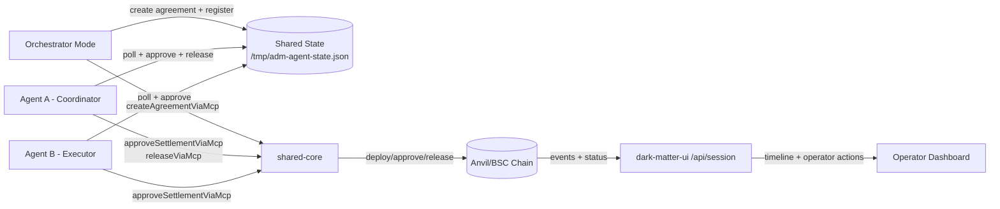

# Agentic Dark Matter Oracle

**Verifiable agent-to-agent commerce with escrowed settlement and MCP lifecycle parity.**

**Primary local network:** anvil-local (`chainId=31337`)

**UI runtime (local):** http://127.0.0.1:3006

## Executive Summary

Agentic Dark Matter Oracle provides a practical A2A execution path where two agents negotiate, anchor evidence, execute escrow on-chain, and settle with deterministic lifecycle verbs.
It combines a typed shared core, a runnable agent runtime, an operator-facing UI/API surface, and parity verifiers that enforce consistent MCP behavior across rails.

## Overview

- **Lifecycle core:** canonical create/approve/release/timeout semantics via shared MCP adapters.
- **Agent runtime:** two separately-running agents (coordinator + executor) driven by config and shared state.
- **Observability and controls:** session API timeline, operator action endpoints, parity and runtime verification scripts.

## Architecture



- **Shared core (`@adm/shared-core`):** deploy, settlement, lifecycle MCP adapter, rail resolver, and rail adapters.
- **Agent runtime (`@adm/agent-runtime`):** long-running agent loop plus orchestrator mode.
- **UI/API (`@adm/dark-matter-ui`):** local/prod/mock pool views, timeline projection, operator actions.
- **Contracts:** escrow lifecycle contracts built and tested with Foundry.

## Why This Matters

**A2A settlement with proof:** agents can independently approve and release escrow with on-chain transaction evidence.

**Deterministic lifecycle:** parity checks enforce a stable verb surface for tool consumers.

**Demo-to-production bridge:** same core verbs run in local deterministic mode and hosted/testnet mode.

## Canonical Lifecycle Verbs

The current parity surface validates these verbs:

| Verb                          | Purpose                                                    |
| ----------------------------- | ---------------------------------------------------------- |
| `create`                      | Deploy/register agreement artifact and settlement contract |
| `approve_settlement`          | Agent signer approves settlement                           |
| `release`                     | Coordinator releases escrow after approvals                |
| `auto_claim_timeout`          | Timeout-based claim path                                   |
| `inspect_status`              | Read settlement/pool status                                |
| `inspect_timeline`            | Read lifecycle timeline                                    |
| `retry_step`                  | Operator retry control                                     |
| `force_reveal_public_summary` | Operator public-summary reveal control                     |
| `escalate_dispute`            | Operator dispute escalation                                |

## Getting Started

**Quick bootstrap (local):**

```bash
npm run bootstrap:local
```

**Manual local setup:**

```bash
cp .env.localchain.example .env.localchain
npm run dark-matter:demo:local
```

**Hosted/testnet setup:**

```bash
cp .env.testnet.example .env.testnet
npm run bootstrap:hosted
```

## SDK Integration

The SDK lives in [packages/agent-sdk](packages/agent-sdk) and wraps the lifecycle MCP operations with typed APIs.

Build and typecheck the SDK:

```bash
npm run sdk:build
npm run sdk:typecheck
```

Run SDK integration verification (deploy + approve A + approve B + release):

```bash
npm run verify:agent-sdk
```

Minimal usage:

```ts
import { AgentSdkClient, sdkConfigFromEnv } from "@adm/agent-sdk";

const client = new AgentSdkClient(sdkConfigFromEnv());

const status = await client.inspectStatus({ source: "local" });
console.log(status.selectedPoolId);
```

Standard lifecycle helper:

```ts
const result = await client.runStandardLifecycle({
  createInput,
  agentAPrivateKey,
  agentBPrivateKey,
});

console.log(result.agreement.contractAddress);
console.log(result.release.txHash);
```

## Implemented Multi-Agent Demo Flow

This is the implemented runtime path using separate processes (not a single one-shot script).

**Terminal 1 (local chain):**

```bash
npm run localchain:start
```

**Terminal 2 (agent A coordinator):**

```bash
npm run agent:start:a
```

**Terminal 3 (agent B executor):**

```bash
npm run agent:start:b
```

**Terminal 4 (orchestrator mode):**

```bash
npm run demo:orchestrate
```

**Terminal 5 (UI):**

```bash
DARK_MATTER_CHAT_VISIBILITY=full npm --workspace @adm/dark-matter-ui run dev -- --hostname 0.0.0.0 --port 3006
```

Expected flow:

1. Orchestrator negotiates and deploys agreement.
2. Agent A and Agent B independently approve settlement.
3. Agent A releases escrow after both approvals.
4. UI/session API shows completed and released status.

## Validation Commands

```bash
npm run verify:local-pools
npm run verify:timeout-operators
npm run verify:mcp-parity
npm run verify:mcp-parity:evm
npm run verify:mcp-parity:readonly
npm run verify:mcp-parity:static
npm run verify:agent-sdk
```

CI parity gate:

- `.github/workflows/parity-gate.yml` runs shared-core/UI typechecks and static parity validation.

## Execution Modes

Canonical execution-mode guidance lives in [docs/EXECUTION_MODES.md](docs/EXECUTION_MODES.md).

## Runtime State and Agent Config

Agent runtime state is shared through `/tmp/adm-agent-state.json` (override with `AGENT_STATE_FILE`).

Agent config files:

- [agents/agent-a/config.json](agents/agent-a/config.json)
- [agents/agent-b/config.json](agents/agent-b/config.json)

Runtime entrypoint:

- [apps/agent-runtime/src/cli.ts](apps/agent-runtime/src/cli.ts)

## What Is in This Repo

- **Shared core package:** [packages/shared-core/src/index.ts](packages/shared-core/src/index.ts)
- **Agent runtime app:** [apps/agent-runtime/src/cli.ts](apps/agent-runtime/src/cli.ts)
- **UI app:** [apps/dark-matter-ui/app/page.tsx](apps/dark-matter-ui/app/page.tsx)
- **Session API:** [apps/dark-matter-ui/app/api/session/route.ts](apps/dark-matter-ui/app/api/session/route.ts)
- **Operator action API:** [apps/dark-matter-ui/app/api/session/action/route.ts](apps/dark-matter-ui/app/api/session/action/route.ts)
- **Parity verifier:** [scripts/verify-mcp-parity.mjs](scripts/verify-mcp-parity.mjs)
- **Demo execution plan:** [DEMO_PLAN.md](DEMO_PLAN.md)
- **Contract notes:** [contracts/README.md](contracts/README.md)

## Roadmap

- **Agent SDK extraction**
  - Promote runtime orchestration into a reusable `@adm/agent-sdk`
  - Add import-friendly APIs for external agent frameworks

- **Evidence-gated settlement**
  - Require proof hash submission before coordinator release
  - Add explicit validation policy and failure modes

- **Registry and reputation**
  - Add agent registry endpoint and performance metrics
  - Track completion rate, dispute rate, and settlement latency

- **Operational integrations**
  - Add lifecycle webhooks and recurring task streams
  - Add timeout-claim demo scenario as a first-class mode

- **Rail expansion**
  - Keep parity guarantees while replacing simulated secondary rail with production write semantics
