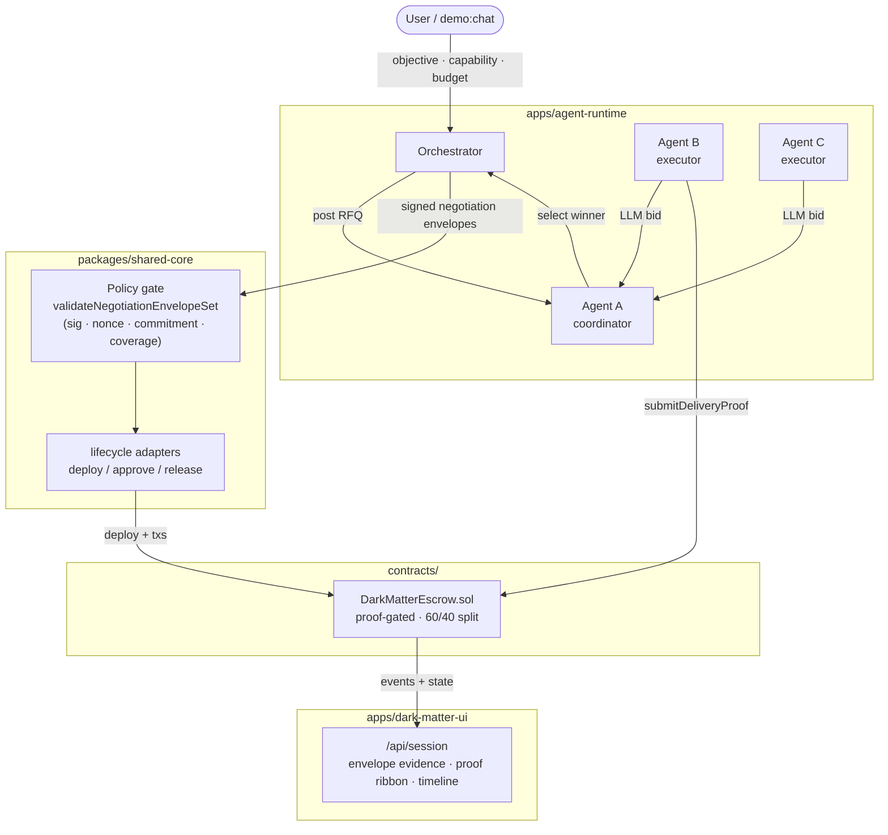

# Agentic Dark Matter

> Verifiable agent-to-agent commerce — RFQ marketplace, signed negotiation envelopes, proof-gated escrow settlement, and on-chain lifecycle evidence on BNB Chain.

**Networks:** anvil-local (`chainId=31337`) · BNB testnet / Chapel (`chainId=97`)  
**Dashboard:** http://localhost:3000/dashboard (local dev)

## What's Built

| Layer | What it does |
|---|---|
| **RFQ marketplace** | Agent A posts a task; Agents B and C compete with LLM-crafted bids; coordinator ranks and selects a winner |
| **Signed negotiation envelopes** | Off-chain terms are committed as cryptographically-signed envelopes with nonce replay protection and delivery commitment binding |
| **Policy gate** | Orchestrator validates the full envelope set (signatures, nonces, cross-signer commitment consistency) before any escrow deploys |
| **Proof-gated escrow** | Custom Solidity contract requires Agent B to submit a `deliveryProofHash` on-chain before settlement can be approved or released |
| **Split payout** | Release and timeout-claim both distribute 60/40 to agent wallets via on-chain bps |
| **Operator dashboard** | Single-page UI with RFQ leaderboard, envelope evidence timeline, and 4-stop proof ribbon with BscScan tx links |
| **LLM + deterministic fallback** | Any OpenAI-compatible endpoint drives bid rationale and selection; deterministic scorer (price 35% / ETA 20% / reliability 25% / fit 20%) makes the demo fully reproducible offline |

## Architecture



**Three boundaries:**

- **Execution boundary** (`apps/agent-runtime`) — long-running agent workers and orchestrator drive lifecycle actions.
- **Protocol boundary** (`packages/shared-core`) — envelope validation, lifecycle adapters, and rail resolvers define _how_ actions execute.
- **Evidence boundary** (chain + UI session timeline) — chain state is settlement truth; session events give operator-facing traceability.

**End-to-end flow:**

1. User types a task into `demo:chat` (objective, capability, budget, ETA, min bids).
2. Orchestrator posts an RFQ into shared state on behalf of Agent A.
3. Executor agents poll, gate by capability, and call an LLM to write bid rationale. Both write bids into shared state.
4. Agent A waits for `minBids`, calls its LLM to rank and select a winner (deterministic fallback if no LLM).
5. Orchestrator and the winner exchange **signed negotiation envelopes**. The policy gate validates signatures, nonces, and delivery commitment binding before proceeding.
6. Escrow contract is deployed. Agent B submits a `deliveryProofHash` on-chain.
7. Both agents approve settlement (approval requires a valid proof to be present).
8. Coordinator releases escrow. UI shows the completed proof ribbon with BscScan tx links.

## Key Implementations

### Signed Negotiation Envelopes (`packages/shared-core/src/negotiationEnvelope.ts`)

Off-chain negotiation terms are signed with ethers v6 and committed before any on-chain action. The policy gate (`validateNegotiationEnvelopeSet`) enforces:

- **Signature validity** — every envelope is verified against its declared signer
- **Nonce replay protection** — nonces are globally tracked; replays are rejected
- **Delivery commitment binding** — each envelope carries a deterministic SHA-256 `deliveryCommitmentHash` (agreementId + objective + participants + termsHash)
- **Cross-signer consistency** — all signers must commit to the same `deliveryCommitmentHash`
- **Signer coverage** — every expected participant must have signed

Startup policy profile logged by the orchestrator:
```
Envelope policy profile: strict=on, replayProtection=on, signatureVerification=on, commitmentBinding=on
```

Run negative-path acceptance tests:
```bash
npm run verify:envelopes
# happy path ✓ · tampered sig ✓ · replayed nonce ✓ · inconsistent commitment ✓
```

### Proof-Gated Escrow (`contracts/src/DarkMatterEscrow.sol`)

- Agent B calls `submitDeliveryProof(bytes32)` on-chain before settlement approval is accepted
- `release()` reverts if no proof has been submitted
- 60/40 bps split distributed to agent wallet addresses on both `release()` and `claimAfterTimeout()`
- 14/14 Foundry tests passing (proof requirement, split distribution, timeout behavior)

```bash
cd contracts && forge test
# Suite result: ok. 14 passed; 0 failed; 0 skipped
```

### RFQ Marketplace (`packages/shared-core/src/negotiation.ts`)

Deterministic scorer with weights: price 35% / ETA 20% / reliability 25% / capability fit 20%. Ties resolved by score → ETA → price → id. LLM override via any OpenAI-compatible endpoint.

### UI Evidence (`apps/dark-matter-ui`)

- Envelope timeline event shows signers, verified/total count, nonce uniqueness ratio, commitment consistency
- 4-stop proof ribbon: `deploy → approve A → approve B → release` with BscScan links
- Operator controls at `/?operator=1`

## Getting Started

**Quick bootstrap (local):**

```bash
npm run bootstrap:local
```

**Manual local setup:**

```bash
cp .env.localchain.example .env.localchain
npm run dark-matter:demo:local
```

**Hosted/testnet setup:**

```bash
cp .env.testnet.example .env.testnet
npm run bootstrap:hosted
```

## SDK Integration

The SDK lives in [packages/agent-sdk](packages/agent-sdk) and wraps the lifecycle MCP operations with typed APIs.

### SDK Install

Following the same install flow: install, configure, verify.

1. **Install**

Published package install:

```bash
npm install @adm/agent-sdk
```

Monorepo local install:

```bash
npm install ./packages/agent-sdk
```

2. **Configure**

Provide environment values before creating the SDK client:

```bash
export DARK_MATTER_RPC_URL=http://127.0.0.1:8545
export DARK_MATTER_CHAIN_ID=31337
export DARK_MATTER_ESCROW_ADDRESS=<deployed_escrow_address>
```

3. **Verify**

Run the verifier to confirm installation and runtime config:

1. **Install**
   npm run verify:agent-sdk

````

Build and typecheck the SDK:

```bash
npm run sdk:build
npm run sdk:typecheck
````

Run SDK integration verification (deploy + approve A + approve B + release):

2. **Configure**
   npm run verify:agent-sdk

````

Minimal usage:

```ts
import { AgentSdkClient, sdkConfigFromEnv } from "@adm/agent-sdk";

3. **Verify**

const status = await client.inspectStatus({ source: "local" });
console.log(status.selectedPoolId);
````

Standard lifecycle helper:

```ts
const result = await client.runStandardLifecycle({
  createInput,
  agentAPrivateKey,
  agentBPrivateKey,
});

console.log(result.agreement.contractAddress);
console.log(result.release.txHash);
```

## Agents

This repo ships first-class support for LLM-driven agents that want to drive the lifecycle from code.

### Agent skill (for Claude / Copilot / similar)

An installable skill at [skills/adm-agent-sdk/SKILL.md](skills/adm-agent-sdk/SKILL.md) contains the complete recipe for importing and using `@adm/agent-sdk`: env setup, quickstart, per-verb reference, error model, verification, and common pitfalls.

Install it into your agent's skills directory so it loads automatically when relevant:

```bash
mkdir -p ~/.agents/skills/adm-agent-sdk
cp skills/adm-agent-sdk/SKILL.md ~/.agents/skills/adm-agent-sdk/SKILL.md
```

The skill self-activates when a user mentions `@adm/agent-sdk`, `AgentSdkClient`, `runStandardLifecycle`, `createAgreement`, `approveSettlement`, `release`, `inspectStatus`, `inspectTimeline`, or general "A2A settlement" / "escrow lifecycle" integration.

### Canonical verbs exposed to agents

All exposed through [packages/agent-sdk/src/client.ts](packages/agent-sdk/src/client.ts):

- `createAgreement` — deploy escrow + register agreement artifact
- `approveSettlement` — agent signer approves
- `release` — coordinator releases after both approvals
- `autoClaimTimeout` — timeout-based claim path
- `inspectStatus` / `inspectTimeline` — read settlement state (retry-enabled)
- `runStandardLifecycle` — one-call helper: create → approve A → approve B → release

### Running agents against the lifecycle

Two processes, one shared state file, one chain:

- [apps/agent-runtime/src/cli.ts](apps/agent-runtime/src/cli.ts) — long-running agent loop + orchestrator mode.
- [agents/agent-a/config.json](agents/agent-a/config.json) / [agents/agent-b/config.json](agents/agent-b/config.json) — local configs.
- [agents/agent-a/config.testnet.json](agents/agent-a/config.testnet.json) / [agents/agent-b/config.testnet.json](agents/agent-b/config.testnet.json) — BNB testnet configs (env var placeholders expanded at load time).
- `/tmp/adm-agent-state.json` — shared state file (override via `AGENT_STATE_FILE`).

See [Implemented Multi-Agent Demo Flow](#implemented-multi-agent-demo-flow) for the exact terminal commands on local anvil and BNB testnet.

### RFQ marketplace

The orchestrator posts an RFQ record before any escrow is deployed. Executor agents compete with bids, and the coordinator picks a winner.

- Deterministic scorer: [packages/shared-core/src/negotiation.ts](packages/shared-core/src/negotiation.ts) — `runRfqSelection()` with weights price 35%, ETA 20%, reliability 25%, capability fit 20%. Ties resolved by score → ETA → price → id.
- LLM-driven bidding and selection: [apps/agent-runtime/src/cli.ts](apps/agent-runtime/src/cli.ts) `maybeSubmitBid()` and `maybeSelectWinner()`. The coordinator demands strict JSON (`{winnerBidId, reasoning}`); a tolerant parser falls back to a heuristic if the model returns prose. If `DARK_MATTER_LLM_ENABLED` is unset, both paths degrade to the deterministic scorer so the demo remains reproducible offline.

To enable LLM mode locally, add any OpenAI-compatible endpoint to your `.env.testnet`:

```bash
DARK_MATTER_LLM_ENABLED=true
DARK_MATTER_LLM_BASE_URL=https://openrouter.ai/api/v1
DARK_MATTER_LLM_MODEL=deepseek/deepseek-chat-v3.1
DARK_MATTER_LLM_API_KEY=sk-or-...
```

`demo:up` automatically sources `DARK_MATTER_LLM_*` values from `.env.testnet` (LLM vars only) while forcing RPC to the local anvil chain. You can also run it against BNB testnet by passing `testnet` as a parameter: `npm run demo:up testnet`.

### Validation

After wiring an agent into the SDK, smoke-test end-to-end:

```bash
npm run verify:agent-sdk
```

This deploys, runs both approvals, and releases against the configured RPC.

## Implemented Multi-Agent Demo Flow

### Local (anvil, chainId=31337) — 3-terminal quick start

One terminal runs the whole runtime (anvil + all agents with colored interleaved logs), one runs the UI, one runs the interactive orchestrator.

**Terminal 1 — anvil + all three agents (colored prefixed logs):**

```bash
npm run demo:up
```

What this does (see [scripts/demo-up.mjs](scripts/demo-up.mjs)):

- starts anvil on `127.0.0.1:8545`,
- clears stale state / log / session files in `/tmp`,
- loads `DARK_MATTER_LLM_*` values from `.env.testnet` (if present) so the agents can use LLMs,
- forces RPC/chainId to local anvil,
- launches Agent A, B, C as child processes and streams their stdout with color-coded prefixes,
- Ctrl+C tears everything down.

**Note:** The unified launcher also supports `npm run demo:up testnet` for BNB testnet mode (see below).

**Terminal 2 — UI pointed at the local state file:**

```bash
npm run ui:dev:local
```

Open [http://localhost:3000/dashboard](http://localhost:3000/dashboard). The dashboard reads `/tmp/adm-agent-state.json` directly and renders real bids, real wallets, real tx hashes. (The deployed Vercel build can’t see `/tmp`, so it falls back to bundled fixtures — see the Vercel section below.)

**Terminal 3 — interactive orchestrator:**

```bash
npm run demo:chat
```

You’ll be prompted for the task (Enter accepts the default in `[brackets]`):

```
What do you need done? [Coordinate 24h community raid across Telegram and Discord for launch week.]:
Primary capability required (e.g. community-raids, telegram-ops, discord-ops, growth-analytics) [community-raids]:
Secondary capabilities (comma-separated, optional) [telegram-ops,discord-ops]:
Max budget in BNB [1]:
Max ETA in minutes [45]:
Minimum bids required before Agent A selects [2]:
```

A scripted non-interactive variant is available as `npm run demo:post-task -- --capability community-raids --budget 1 --eta 45 --min-bids 2` for CI.

### Legacy (one terminal per process)

For low-level debugging you can still run each piece separately:

```bash
npm run localchain:start   # Terminal 1
npm run agent:start:a      # Terminal 2
npm run agent:start:b      # Terminal 3
npm run agent:start:c      # Terminal 4
npm run demo:chat          # Terminal 5
```

### BNB testnet (Chapel, chainId=97) — 3-terminal quick start

Same 3-terminal shape as local, but pointed at BSC testnet. Requires 3 funded wallets (Agent A coordinator + Agent B and C executors). See [.env.testnet.example](.env.testnet.example).

**One-time setup:**

1. Copy `.env.testnet.example` to `.env.testnet` and fill in all three wallets:
   ```bash
   cp .env.testnet.example .env.testnet
   # edit: DARK_MATTER_DEPLOYER_PRIVATE_KEY / AGENT_A_*, AGENT_B_*, AGENT_C_*
   ```
2. Fund the executor wallets (get testnet BNB from [testnet.bnbchain.org/faucet-smart](https://testnet.bnbchain.org/faucet-smart) or top up from Wallet 1):
   ```bash
   npm run testnet:fund          # balance check (dry-run)
   npm run testnet:fund:send     # top up Wallet 2 from Wallet 1 if low
   ```

**Terminal 1 — agents A/B/C against BSC testnet:**

```bash
npm run demo:up testnet
```

This is the same unified launcher as local mode, but with the `testnet` parameter. It:

- loads the full `.env.testnet` (LLM keys, RPC, chainId=97, all three agent keys),
- validates that Agent A/B/C keys are present,
- clears stale `/tmp/adm-agent-state.json` / logs / session files,
- connects to the testnet RPC and launches all three agents as child processes with color-coded prefixed logs.

**Terminal 2 — UI pointed at testnet state:**

```bash
npm run ui:dev:testnet:state
```

This reads the same `/tmp/adm-agent-state.json` but renders `bsc-testnet` as the network label so timeline tx hashes link to `testnet.bscscan.com`.

**Terminal 3 \u2014 interactive orchestrator (testnet):**

```bash
npm run demo:chat:testnet
```

Same interactive prompt as the local `demo:chat`, but posts the RFQ against BSC testnet and the resulting escrow contract is deployed on Chapel.

### BNB testnet \u2014 legacy per-process flow

For low-level debugging each process can still be started separately:

```bash
npm run agent:a:testnet          # Terminal 1
npm run agent:b:testnet          # Terminal 2
npm run agent:c:testnet          # Terminal 3
npm run demo:orchestrate:testnet # Terminal 4 (non-interactive)
npm run ui:dev:testnet           # Terminal 5 (reads legacy session file)
```

UI production build / serve against testnet:

```bash
npm run ui:build:testnet         # production build
npm run ui:start:testnet         # production serve
```

Every contract, approval, and release transaction in the UI links to `testnet.bscscan.com`.\n\n### Vercel deployment status\n\nThe hosted UI at Vercel ([apps/dark-matter-ui/vercel.json](apps/dark-matter-ui/vercel.json)) currently renders **bundled fixtures only**. Serverless functions on Vercel have no access to `/tmp/adm-agent-state.json` and there are no long-running agent processes on that platform, so real RFQ \u2192 bid \u2192 settlement runs happen locally.\n\nTo see a real run, use the 3-terminal local flow above. Planned next step is wiring shared state to Upstash Redis (or similar) and hosting the agent workers on Fly.io / Railway so the hosted dashboard can reflect live agents.

### Expected flow

1. User posts a task through `demo:chat`.
2. Orchestrator writes an RFQ into shared state.
3. Executor agents poll, filter by capability, call their LLM to craft bid rationale, and submit bids.
4. Coordinator (Agent A) waits for `minBids`, calls its LLM to rank bids and select a winner with structured reasoning (deterministic fallback if no LLM).
5. Orchestrator negotiates terms with the winner and deploys the escrow agreement.
6. Executor submits a delivery proof hash, then both parties approve (approvals are guarded by LLM review that requires the proof).
7. Coordinator releases escrow after both approvals.
8. UI shows completed status with a proof ribbon (deploy → approve A → approve B → release) and a per-pool timeline of RFQ → bids → selection → approvals → release.

### Demo UI at a glance

The single-page demo view is laid out top → bottom:

1. **Hero strip** — network + live state chip, latest agreement with BscScan CTA.
2. **Agent A / Agent B / Deal cards** — avatars, wallets (copy), capabilities, escrow + hashes.
3. **Other agreements & pools** — collapsed pool browser with search.
4. **Step 2 — RFQ auction** — scored leaderboard, winner ribbon, scoring-weights legend.
5. **Step 3 — On-chain settlement** — 4-stop proof ribbon with BscScan links.
6. **Transcript & timeline** — vertical spine, alternating cards, animated once on load.

Operator action buttons are gated behind a query flag: visit `/?operator=1` to reveal retry / force-reveal / escalate controls in the timeline.

## Validation Commands

```bash
npm run verify:local-pools
npm run verify:timeout-operators
npm run verify:mcp-parity
npm run verify:mcp-parity:evm
npm run verify:mcp-parity:readonly
npm run verify:mcp-parity:static
npm run verify:agent-sdk
```

CI parity gate:

- `.github/workflows/parity-gate.yml` runs shared-core/UI typechecks and static parity validation.

## Execution Modes

Canonical execution-mode guidance lives in [docs/EXECUTION_MODES.md](docs/EXECUTION_MODES.md).

## Runtime State and Agent Config

Agent runtime state is shared through `/tmp/adm-agent-state.json` (override with `AGENT_STATE_FILE`).

Agent config files:

- [agents/agent-a/config.json](agents/agent-a/config.json) (local — coordinator)
- [agents/agent-b/config.json](agents/agent-b/config.json) (local — executor, Telegram persona)
- [agents/agent-c/config.json](agents/agent-c/config.json) (local — executor, Discord persona)
- [agents/agent-a/config.testnet.json](agents/agent-a/config.testnet.json) (BNB testnet)
- [agents/agent-b/config.testnet.json](agents/agent-b/config.testnet.json) (BNB testnet)

Each config carries a `persona` block (system prompt + style + goals + voice) that the agent passes to the LLM when crafting bids, selection reasoning, and approval decisions.

Runtime entrypoint:

- [apps/agent-runtime/src/cli.ts](apps/agent-runtime/src/cli.ts)

RFQ auction engine:

- [packages/shared-core/src/negotiation.ts](packages/shared-core/src/negotiation.ts) \u2014 `runRfqSelection()` with weights price 35%, ETA 20%, reliability 25%, capability fit 20%.

## What Is in This Repo

- **Shared core package:** [packages/shared-core/src/index.ts](packages/shared-core/src/index.ts)
- **Agent runtime app:** [apps/agent-runtime/src/cli.ts](apps/agent-runtime/src/cli.ts)
- **UI app:** [apps/dark-matter-ui/app/page.tsx](apps/dark-matter-ui/app/page.tsx)
- **Session API:** [apps/dark-matter-ui/app/api/session/route.ts](apps/dark-matter-ui/app/api/session/route.ts)
- **Operator action API:** [apps/dark-matter-ui/app/api/session/action/route.ts](apps/dark-matter-ui/app/api/session/action/route.ts)
- **Parity verifier:** [scripts/verify-mcp-parity.mjs](scripts/verify-mcp-parity.mjs)
- **Demo execution plan:** [DEMO_PLAN.md](DEMO_PLAN.md)
- **Contract notes:** [contracts/README.md](contracts/README.md)

## Roadmap

- **Richer private coordination rails** — encrypted off-chain negotiation with verifiable transcripts
- **Agent identity and reputation** — registry-backed agent identity, completion rate, dispute rate, settlement latency
- **Operational integrations** — lifecycle webhooks, recurring task streams, hosted agent workers (Fly.io/Railway) with shared Redis state so the Vercel dashboard can reflect live agents
